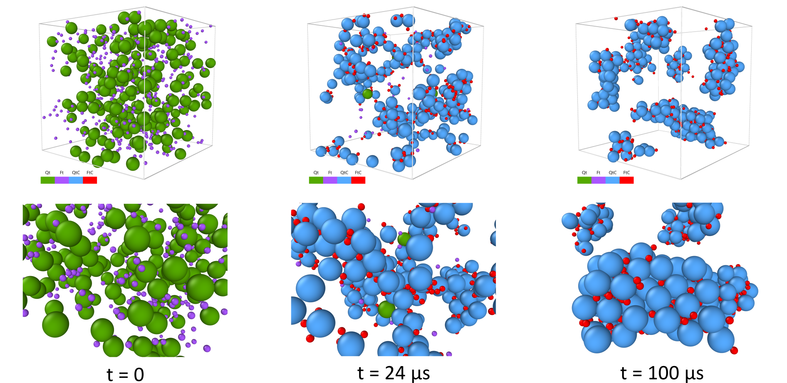
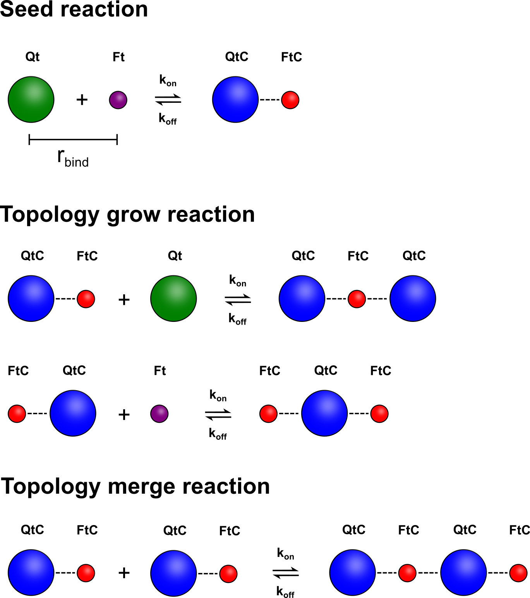

# iPRD Simulation of an Encapsulin–Ferritin Sensor (ReaDDy2)

Coarse-grained **interacting-particle reaction–dynamics (iPRD)** simulation of an
**encapsulin–ferritin sensor** — **Qt encapsulins (Qt)** and **ferritin (Ft)**
nanoparticles agglomerating in solution — built on [ReaDDy2](https://readdy.github.io/)
(Hoffmann, Fröhner & Noé 2019). Two diffusing species bind into growing clusters
("topologies") through stochastic spatial reactions; the code measures the resulting
**agglomeration kinetics** and **cluster morphology**, across single runs and multi-replica
ensembles, locally or on a SLURM cluster.

The overall pipeline is:

```
configure ─▶ equilibrate (no reactions) ─▶ production (reactions)
          ─▶ analyze trajectory ─▶ plot ─▶ (ensemble averaging / cross-ensemble comparison)
```

<p align="center">
  
</p>

<p align="center"><em>A single 100 µs run in the earlier LJ setup (OVITO render): free Qt (green) and Ft (purple) start
dispersed and progressively bind into growing clusters of QtC (blue) and FtC (red). Bottom row is a
zoomed detail. The current preset uses soft mode to reach far longer simulated times.</em></p>

---

**Contents** —
[1 Physical model](#1-physical-model) ·
[2 Potentials](#2-potentials) ·
[3 Repository layout](#3-repository-layout) ·
[4 Requirements](#4-requirements) ·
[5 Quick start](#5-quick-start--single-run) ·
[6 Configuration reference](#6-configuration-reference) ·
[7 Running ensembles](#7-running-ensembles) ·
[8 Cluster (SLURM) execution](#8-cluster-slurm-execution) ·
[9 Analysis & outputs](#9-analysis--outputs) ·
[10 Plotting](#10-plotting) ·
[11 Output-file naming](#11-output-file-naming-convention) ·
[12 Limitations](#12-limitations) ·
[13 Citing ReaDDy](#13-citing-readdy)

Deeper material lives alongside: [soft mode & calibration](docs/soft-mode-calibration.md),
[FIB-SEM comparison export](docs/fibsem-export.md).

---

## 1. Physical model

**Species.** Two free particle types plus their auto-derived "clustered" counterparts, all
managed as ReaDDy *topology species* inside a single topology type `QtFt_Cluster`:

| Symbol | Meaning              | State            |
|--------|----------------------|------------------|
| `Qt`   | Qt encapsulin        | free / monomer   |
| `Ft`   | Ferritin             | free / monomer   |
| `QtC`  | Qt in a cluster      | bound            |
| `FtC`  | Ft in a cluster      | bound            |

**Reactions** (spatial topology reactions, Gillespie handler). All fire when two eligible
particles come within `binding_radius`, at rate `kon`:

| Name                       | Reaction                          | Role                       |
|----------------------------|-----------------------------------|----------------------------|
| `seed_QtFt_Cluster`        | `Qt + Ft → QtC–FtC`               | nucleate a new cluster     |
| `grow_QtC_Ft_QtFt_Cluster` | `QtC + Ft → QtC–FtC`              | cluster captures a free Ft |
| `grow_FtC_Qt_QtFt_Cluster` | `FtC + Qt → FtC–QtC`              | cluster captures a free Qt |
| `merge_QtC_FtC_QtFt_Cluster`| `QtC + FtC → QtC–FtC`            | two clusters merge         |

<p align="center">
  
</p>

<p align="center"><em>The topology reactions: a <strong>seed</strong> nucleates a cluster from a free Qt + Ft, <strong>grow</strong>
reactions capture a free monomer onto an existing cluster, and <strong>merge</strong> joins two clusters — each
firing at rate k<sub>on</sub> within r<sub>bind</sub> and reversible at rate k<sub>off</sub> in deagglomeration phases.</em></p>

**Monovalent Ft (`topology.ft_monovalent`, default `False`).** ReaDDy has no bond cap; valence
follows from which particle types appear as reactants. `grow_FtC_Qt` and `merge_QtC_FtC` are the
only reactions that give an already-bonded `FtC` a *second* bond, so `ft_monovalent=True` simply
skips them: `FtC` becomes terminal, every Ft forms **at most one bond**, and clusters become
single-Qt stars (one multivalent Qt + N monovalent Ft leaves) that never merge. Qt stays
multivalent; the default reproduces the original multivalent model.

**Loop-permitting binding (`topology.allow_loops`, default `False`).** All four reactions are
fusions between two *different* topologies, so by default a bond never forms inside a cluster
and clusters are strictly **acyclic trees**. Only `merge_QtC_FtC` ever has both partners already
clustered, so `allow_loops=True` registers that one reaction with ReaDDy's `[self=true]` flag,
letting it fire **within** a cluster and close a ring — clusters become crosslinked networks
rather than trees. Has effect only when `ft_monovalent=False`, and adds a `_loops` filename tag.

**Equilibration vs production.** Equilibration runs with **reactions disabled** under
`config.equilibration_potential` (default `"WCA"`, purely repulsive) to relax the random initial
positions; production then switches on `config.potential_type` and the binding reactions. The
split is handled by `equilibrate_system()` + `run_simulation()`. In soft mode equilibration is
optional altogether — harmonic repulsion tolerates initial overlaps — so a run can start straight
from random placement with `run_one(..., skip_equilibration=True)`.

**Deagglomeration & cycling (`config.phases`).** A run can be split into a sequence of *phases*
to model an **agglomeration ↔ deagglomeration cycle**. Each `PhaseConfig` sets `n_steps` plus
that phase's physics: `binding`, `breaking` and `potential_type`. Bond breaking is a structural
topology dissociation — a cluster loses one uniformly-random bond at total rate
`n_edges × topology.koff`, splitting into sub-clusters, and a freed monomer is re-typed back to
its free species (`QtC→Qt`, `FtC→Ft`). Build a schedule with
`make_agg_deagg_phases(agg_steps, deagg_steps, n_cycles=...)`. ReaDDy cannot change reactions
mid-run, so `run_phased()` runs each phase as a separate segment and carries positions **and**
bonds across phases via checkpoints, writing one `phase_NNN/trajectory.h5` per phase; analysis
stitches them onto one continuous time axis (`analysis.load_phased_observables`). `run_one()`
dispatches to `run_phased()` automatically when `config.phases` is set, for single runs and
ensembles alike.

**Integrator / environment.** EulerBD Brownian-dynamics integrator, Gillespie reactions,
cubic box, `T = 300 K`.

**Boundaries (`config.boundary`, default `"periodic"`).** `"periodic"` wraps the box.
`"reflective"` switches periodicity off and confines every species with a repulsive box
potential (ReaDDy's `add_box`, stiffness `config.wall_force_constant`, default 5.0) — ReaDDy has
no specular-reflection boundary, so a soft wall is the idiom. The wall spans the **full** box, so
particle *centres* are confined and the accessible volume, hence the concentration, is identical
to a periodic run; thermal penetration of the wall is `≈ √(2·kᵦT/k)` ≈ 1 nm at the default
stiffness (measured max ≈ 2 nm, against a 25 nm Qt radius). Walls are registered inside
`create_system`, so they apply to equilibration, plain production **and every phase**, and
therefore to ensembles too.

The analysis honours the setting: the minimum-image convention and the per-cluster periodic
unwrap are applied only when the box is periodic (`config.is_periodic`) — in a 500 nm box a pair
more than 250 nm apart would otherwise be wrapped and reported far closer than it is. Two things
remain periodic-flavoured and are mildly biased near walls: ReaDDy's RDF observable, and the
`expected_nn_dist` reference value in `get_spatial_distribution`.

---

## 2. Potentials

`config.potential_type` selects the production potential and `config.equilibration_potential`
the one used while equilibrating. Each mode reads **only** its own config block; the others are
ignored. All 10 type pairs are registered in every mode.

| `potential_type` | ReaDDy potential | Attractive | Parameters | Role |
|---|---|---|---|---|
| `"WCA"` | Lennard-Jones cut at `2^(1/6)·σ` | no | `lj.epsilon_*` | equilibration; repulsive-only production |
| `"LJ"` | Lennard-Jones cut at `2.5·σ` | yes | `lj.epsilon_*` | the original production setup (50 ps timestep) |
| `"soft"` | `add_harmonic_repulsion` | no | `soft.k_*` | current preset; tolerates a µs timestep |
| `"weak"` | `add_weak_interaction_piecewise_harmonic` | yes | `weak.k_*`, `weak.depth_*`, `weak.cutoff_factor` | LJ-like attraction without the `r⁻¹²` wall |

For the two Lennard-Jones modes σ is chosen so the LJ minimum (and the WCA exclusion edge) sits
at the contact distance: `σ = (r_i + r_j) / 2^(1/6) ≈ 0.8909·(r_i + r_j)`, which places the well
minimum at `r_i + r_j` — the harmonic bond length — so bonded pairs are not squeezed by a
mismatched minimum.

**Harmonic bonds** (`topology.k_bond`) hold bonded particles inside a cluster at equilibrium
length `r_Qt + r_Ft`. They are registered in every mode.

**Soft mode** replaces the stiff `r⁻¹²` wall with a bounded, linear force that vanishes at
contact, so an overlap produces a small finite force instead of a blow-up and a far larger
timestep stays stable. There is **no attractive term** — clustering comes purely from the
binding reactions plus harmonic bonds. Stability bounds, the calibration workflow and the
measured force constants the current preset ships are in
[docs/soft-mode-calibration.md](docs/soft-mode-calibration.md).

**Parameter cascade.** Every mode is parameterised per pair, but only the three free–free
values are normally set; the seven cluster/mixed pairs inherit them unless overridden:

```
QtQt, FtFt, QtFt                                        (set these)
  └▶ QtCQtC ← QtQt    FtCFtC ← FtFt    QtCFtC ← QtFt     (cluster pairs ← free–free)
       └▶ QtQtC, FtFtC, QtCFt, QtFtC                     (mixed pairs ← cluster)
```

This applies identically to `lj.epsilon_*`, `soft.k_*`, `weak.k_*` and `weak.depth_*`. Setting a
value to `0` disables that pair's interaction entirely.

---

## 3. Repository layout

All code lives in the **`qtft`** package; `scripts/` holds thin CLI wrappers.

| Module | Purpose |
|--------|---------|
| `qtft.config` | Config dataclasses (`SimulationConfig` etc.), the `format_param_string` naming convention, and the `NS_TO_US`/`_steps_to_us` units helpers. Single source of truth. |
| `qtft.system` | ReaDDy system builders: `create_system`, species/potentials/topologies. |
| `qtft.engine` | Build + run: `create_simulation`, `place_particles`, `run_simulation`, `equilibrate_system`, and the one-shot `run_one`. |
| `qtft.ensemble` | `EnsembleSimulation` class — multi-replica orchestration, local/parallel runs, SLURM script generation, result collection, statistics, save/load. |
| `qtft.analysis` | Matplotlib-free trajectory analysis: cluster stats, bond counts, binding kinetics, morphology (Rg), spatial distribution, contacts, composition, size fractions. Also `convert_h5_to_xyz` (OVITO), `load_ensemble_data`, and numeric results tables (`build_final_state_table`, `save_table_files`). |
| `qtft.plotting` | All matplotlib plots: single-run, ensemble, and cross-ensemble comparison figures, including the composite "thesis" panels `plot_metrics_panel` / `plot_comparison_panel` (each writes paired SVG + PNG via `save_path_base`), and `plot_overlap_timeseries` (overlapping pairs over time). |
| `qtft.comparison` | Cross-ensemble comparison helpers (`compare_ensembles`, `save/load_comparison_data`, `build_comparison_table`, …). |
| `qtft.fibsem_export` | Export the **final frame** to the FIB-SEM segmentation schema for experiment comparison: encapsulin (Qt/QtC) centroids with ground-truth cluster IDs, written into `<run_dir>/FIBSEM_Comparison_Export/` beside the run. Read-only — it consumes a finished trajectory and never runs a simulation. See [docs/fibsem-export.md](docs/fibsem-export.md). |
| `scripts/analyze_ensemble.py` | CLI to (re)analyze an ensemble directory in parallel; `compare` subcommand. |
| `scripts/run_replica.py` | CLI to run **one** replica from a config JSON (used locally and by SLURM job arrays). |
| `scripts/check_codebase.py` | Standing consistency check: dead functions, unused imports, and README/docstring names that no longer exist. AST-based, so a name inside a docstring or log string does not keep dead code alive, while a function passed by reference is correctly seen as used. `--strict` exits non-zero for CI or a pre-commit hook. |
| `scripts/calibrate_timestep.py` | CLI "measure-first" sweep over `(timestep, diffusion)` in **soft** mode: reports stability (finite + bond-length drift), the diffusion criterion, reaction-probability saturation, the largest stable `dt`, and reachable simulated time. See [docs/soft-mode-calibration.md](docs/soft-mode-calibration.md). |
| `scripts/calibrate_soft_k.py` | CLI sweep over the **soft**-mode force constants `soft.k_*`: measures interpenetration (via `analysis.get_overlap_statistics`) against numerical stability, reported with the per-step overshoot ratio `alpha = k·D·dt/(kB·T)`. See [docs/soft-mode-calibration.md](docs/soft-mode-calibration.md). |
| `Run_Simulation.ipynb` | Run-only notebook: one **Configuration** cell (all parameters) + one **Run** cell that dispatches on `RUN_MODE` (`single`/`ensemble`) and `ENABLE_DEAGG` (plain vs agglomeration↔deagglomeration cycling); optional SLURM cell. Its only plot is the optional overlap-vs-time figure (`PLOT_OVERLAP`, saved under `Plots/`). |
| `Plot_Simulation_Results.ipynb` | Plotting/reporting notebook: one **Settings** cell + one **Run** cell selected by `MODE` (`single` trajectory / `ensemble` directory / `comparison` of several). Each mode auto-generates the plots **and** the text summary **and** the data/table exports (CSV/LaTeX) into a `Plots/` folder. |
| `Export_for_FIB-SEM_Comparison.ipynb` | Export notebook: points at a finished run, writes the encapsulin centroid CSV + metadata JSON in the FIB-SEM schema, and plots a cluster-coloured scatter as a periodic-unwrap sanity check. See [docs/fibsem-export.md](docs/fibsem-export.md). |
| `docs/soft-mode-calibration.md` | Why soft mode reaches a µs timestep: stability bounds, the `alpha = k·D·dt/(kB·T)` overshoot rule, the measured force-constant sweep, and both calibration CLIs. |
| `docs/fibsem-export.md` | The FIB-SEM comparison export in detail: what is extracted, run-layout resolution, output files, and the periodicity caveat. |

---

---

## 4. Requirements

- Python 3.x with **ReaDDy2** (install via conda; the SLURM scripts assume a conda env named
  `readdy`):
  ```bash
  conda create -n readdy -c readdy -c conda-forge readdy
  conda activate readdy
  ```
  ReaDDy asks to be cited in any work that uses it — see
  [Citing ReaDDy](#13-citing-readdy).
- `numpy`, `matplotlib`, `pandas`, `h5py` (pulled in by ReaDDy / standard scientific stack).
- For visualization of `.xyz` exports: [OVITO](https://www.ovito.org/) (external, optional).

Progress messages are emitted through the `qtft` logger (streamed to stdout by default, so
notebook output is unchanged). Quiet or redirect it with
`qtft.set_log_level(logging.WARNING)`; the formatted `print_*` summary/report functions always
write to stdout.

---

---

## 5. Quick start — single run

`Run_Simulation.ipynb` drives this from one **Configuration** cell and one **Run** cell. The
one-shot `sim.run_one(config)` wraps equilibrate → build → place → run.

```python
import qtft as sim
import qtft.analysis as analysis
import qtft.plotting as plotting

# 1. Configure — the current notebook preset (soft mode)
config = sim.SimulationConfig(
    qt=sim.ParticleConfig("Qt", radius=25.0, diffusion=2e-4, cluster_diffusion=2e-4),
    ft=sim.ParticleConfig("Ft", radius=7.0, diffusion=5e-4, cluster_diffusion=5e-4),
    topology=sim.TopologyConfig(binding_radius=32.0, kon=1e-6, k_bond=1.0,
                                allow_loops=True),
    potential_type="soft",      # top-level selector: "WCA" | "LJ" | "soft" | "weak"
    soft=sim.SoftPotentialConfig(k_QtQt=4.0, k_FtFt=3.0, k_QtFt=1.5),
    equilibration_potential="soft",   # WCA/LJ would blow up at this dt
    box_size=(500.0, 500.0, 500.0),
    temperature=300.0,
    timestep=1e3,         # ns  (=1 µs)
    n_steps=750_000,      # → 750 ms total
    record_stride=100,
    observable_stride=100,
    particles_observable_stride=None,   # structural analysis reads positions from the trajectory
    n_qt=200,
    n_ft=400,
)

# 2. Run. Soft repulsion tolerates initial overlaps, so equilibration is optional:
trajectory = sim.run_one(config, skip_equilibration=True)

# 3. Analyze + plot. One (stats, structural, config) triple drives every figure:
analysis.print_analysis_summary(config.output_file, config)
stats, structural, cfg = analysis.build_single_run_plotting_data(config.output_file, config)
plotting.plot_metrics_panel(stats, structural, cfg, save_path_base="Plots/panel")
plotting.plot_kinetics([{"label": "run",
                         "data": analysis.build_kinetics_data_single(config.output_file, config)}],
                       save_path_base="Plots/kinetics")

# Optional: export for OVITO, and save the config
analysis.convert_h5_to_xyz(config.output_file, config.output_file.replace(".h5", ".xyz"), config, overwrite=True)
config.save_json("simulation_config.json")
```

`config.output_file` is auto-generated from the parameters if left `None`. To drive the steps
yourself instead of `run_one`, the building blocks are public: `equilibrate_system` →
`create_system` → `create_simulation` → `place_particles` → `run_simulation`.

---

## 6. Configuration reference

`SimulationConfig` (in `qtft.config`) is the single source of truth and is
fully JSON-serializable (`config.save_json(...)` / `SimulationConfig.load_json(...)`,
`from_dict` / `to_dict` / `to_flat_dict`).

The table below leads with the **current values in `Run_Simulation.ipynb`** — the soft-mode,
750 ms preset. The code dataclass defaults are small smoke-test values — see the footnote.

> The ensembles in `Different_Particle_Ratios/` predate this preset: they were produced with
> the earlier **LJ** parameters (50 ps timestep, 100 µs, Qt r=21 / Ft r=6). Each dataset's
> exact parameters are recorded in its own `ensemble_config.json`, and are encoded in its
> directory name (see [Output-file naming convention](#11-output-file-naming-convention)).

| Parameter | Meaning | Units | Notebook value |
|-----------|---------|-------|----------------|
| `qt.radius`, `qt.diffusion` | Qt encapsulin size & diffusion | nm, nm²/ns | 25.0, 2e-4 |
| `qt.cluster_diffusion` | Qt diffusion once bound in a cluster | nm²/ns | 2e-4 (= monomer, see [Limitations](#12-limitations)) |
| `ft.radius`, `ft.diffusion` | Ft ferritin size & diffusion | nm, nm²/ns | 7.0, 5e-4 |
| `ft.cluster_diffusion` | Ft diffusion once bound in a cluster | nm²/ns | 5e-4 (= monomer, see [Limitations](#12-limitations)) |
| `n_qt`, `n_ft` | particle counts | – | 200 / 400 |
| `topology.binding_radius` | reaction capture distance | nm | 32.0 (= r_Qt+r_Ft, i.e. contact) |
| `topology.kon` | microscopic binding rate (per-pair; see [Limitations](#12-limitations)) | 1/ns | 1e-6 |
| `topology.k_bond` | harmonic bond stiffness | kJ/(mol·nm²) | 1.0 (soft, for the large `dt`) |
| `topology.ft_monovalent` | cap Ft at one bond → single-Qt-star clusters | – | `False` |
| `topology.allow_loops` | let `merge_QtC_FtC` self-fuse → intra-cluster loops (crosslinked networks, not trees); needs `ft_monovalent=False`; adds `_loops` tag | – | `True` |
| `topology.koff` | bond-breaking rate per edge (deagglomeration phases only) | 1/ns | 0.0 |
| `phases` | optional list of `PhaseConfig` for agglomeration↔deagglomeration cycling; `None` = single run | – | `None` |
| `lj.epsilon_QtQt/FtFt/QtFt` | well depths for the three free pairs — **ignored in soft mode** | kJ/mol | 1.5 / 1.5 / 3.0 (unused) |
| `potential_type` | **top-level** production selector: `"WCA"` (repulsive), `"LJ"` (attractive), `"soft"` (harmonic repulsion), or `"weak"` (piecewise-harmonic weak interaction). Picks which block is registered (`lj.epsilon_*` / `soft.k_*` / `weak.k_*,depth_*`); the others are ignored | – | `soft` |
| `soft.k_QtQt/k_FtFt/k_QtFt` | per-pair harmonic-repulsion stiffness (free-free; cluster/mixed cascade), used only when `potential_type="soft"`; `k=0` disables a pair | kJ/(mol·nm²) | 4.0 / 3.0 / 1.5 (calibrated, see [docs/soft-mode-calibration.md](docs/soft-mode-calibration.md)) |
| `weak.k_QtQt/…` / `weak.depth_QtQt/…` | per-pair force constant + well depth for `potential_type="weak"` (free-free; cluster/mixed cascade); `k=0` disables a pair | kJ/(mol·nm²), kJ/mol | 0.5 / 3.0 / 2.0 and 0.25 / 0.1 / 8.0 (unused in soft mode) |
| `weak.cutoff_factor` | weak-mode cutoff as a multiple of contact (`cutoff = factor × (r_i+r_j)`, must be > 1) | – | 1.1 |
| `box_size` | cubic box edge | nm | (500, 500, 500) |
| `boundary` | `"periodic"` (wrap) or `"reflective"` (periodicity off + repulsive box walls on all species; adds a `_reflective` filename tag). Read it via `config.is_periodic` | – | `periodic` |
| `wall_force_constant` | reflective-wall stiffness; ignored when periodic. Too soft leaks (k=1 → 10/600 out), 5.0 confines | kJ/(mol·nm²) | 5.0 |
| `temperature` | – | K | 300 |
| `equilibration_potential` | potential during equilibration (`"WCA"`, `"LJ"`, `"soft"`, or `"weak"`); reactions always off | – | `soft` (must be soft/weak at this `dt`) |
| `timestep` | integration step | ns | 1e3 (1 µs) |
| `n_steps` | total steps (→ 750 ms) | – | 750,000 |
| `record_stride`, `observable_stride` | save cadence | steps | 100 |
| `particles_observable_stride` | per-particle position cadence. **Optional/redundant** — `None` (default) is recommended: structural/morphology/overlap analyses read positions from the recorded trajectory (`record_stride`). Set an integer only to speed up per-frame structural analysis, at the cost of storing positions twice | steps | `None` |
| `heavy_observable_stride` | cadence for unread heavy observables (forces, virial); `None`=100×`observable_stride` | steps | optional |
| `kernel`, `n_threads` | `"CPU"`/`"SingleCPU"`, threads. Note: with `n_threads > 1` runs are **not** reproducible from the seed | – | CPU, 4 |
| `rng_seed` | RNG seed (per-replica in ensembles) | – | 22 |
| `output_file` | trajectory path (`None` = auto) | – | auto |

> **Code dataclass defaults** (smoke-test only, *not* the real runs): Qt r=1.0 D=5.0,
> Ft r=0.25 D=15.0, `binding_radius=1.5`, `kon=10.0`, `k_bond=20.0`, all ε=10.0,
> `potential_type="WCA"`, `box_size=(50,50,50)`, `timestep=1e-4`, `n_steps=200000`,
> `n_qt=n_ft=200`, `rng_seed=42`.

---

## 7. Running ensembles

`EnsembleSimulation` (in `qtft.ensemble`) replicates a base config with independent RNG seeds,
runs the replicas, and aggregates the results.

```python
from qtft import EnsembleSimulation

ensemble = EnsembleSimulation(base_config=config, n_replicas=10, base_dir="ensembles")
ensemble.run_local(parallel=True, n_workers=10, overwrite=True, equilibration_steps=5000)

stats, structural, cfg = ensemble.to_plotting_format()
plotting.plot_metrics_panel(stats, structural, cfg, show_individual=True,
                            save_path_base="Plots/panel")
```

`run_local` runs every replica, then collects and computes statistics into an output directory
named from the parameter string:

```
<ensemble_dir>/
├── configs/config_000.json …      # per-replica configs (differ only by seed)
├── replica_000/ …                 # each has trajectory.h5 (+ optional trajectory.xyz)
├── logs/                          # stdout/stderr (SLURM runs)
├── ensemble_config.json           # base configuration
├── ensemble_statistics.json       # time-series means ± std (+ per-replica traces)
├── ensemble_structural.npz        # morphology / spatial / contacts / composition / size fractions
├── ensemble_state.json            # full state for EnsembleSimulation.load()
└── submit_*.slurm                 # if SLURM scripts were generated
```

Reload a finished ensemble with `EnsembleSimulation.load("<ensemble_dir>")`.

**Phased ensembles.** Give `base_config` a `phases` schedule and run exactly as above — replicas
inherit cycling because they all go through `run_one()`. Each replica then holds
`replica_NNN/phase_000/trajectory.h5 …`, and collection stitches the phases per replica onto one
continuous time axis before averaging, so the saved file formats are unchanged.

---

## 8. Cluster (SLURM) execution

For HPC, generate job-array scripts instead of running locally:

```python
ensemble.generate_slurm_scripts(
    partition="cm4_tiny", cluster="cm4", time="08:00:00",
    cpus_per_task=12, memory="32G",
    conda_base="<CONDA_PATH>", conda_env="readdy",
)
ensemble.generate_analysis_slurm_script(
    partition="cm4_tiny", time="04:00:00", cpus_per_task=4, stride=10,
)
```

This writes `submit_ensemble.slurm` (a job array; each task runs one replica via
`scripts/run_replica.py --config configs/config_NNN.json`) and `submit_analysis.slurm` (runs
`scripts/analyze_ensemble.py` once all replicas finish). Submit them with `sbatch`. The SLURM
scripts ship the `qtft/` package and `scripts/` to the cluster (`scp -r qtft scripts ...`).

`scripts/run_replica.py` can also be invoked directly:

```bash
python scripts/run_replica.py --config configs/config_000.json
python scripts/run_replica.py --config configs/config_000.json --equilibration-steps 20000
python scripts/run_replica.py --config configs/config_000.json --skip-equilibration
```

---

## 9. Analysis & outputs

Re-analyze (or analyze for the first time) an ensemble directory in parallel:

```bash
python scripts/analyze_ensemble.py --ensemble-dir <ensemble_dir> --parallel --n-workers 4 --stride 10
```

This (re)writes `ensemble_statistics.json` and `ensemble_structural.npz`.

**Metrics computed** (`qtft.analysis`):

| Group | Contents |
|---|---|
| Kinetics | bond counts over time, binding rate, free vs clustered Qt/Ft, fraction bound, half-times |
| Cluster stats | number of clusters, size distribution, average & largest cluster size, adaptive size-category fractions |
| Morphology | radius of gyration Rg per cluster, normalized compactness (Rg/Rg_ideal) |
| Spatial | cluster centers (PBC-aware), inter- and intra-cluster nearest-neighbour distances |
| Contacts | coordination numbers per particle type, bonds per cluster |
| Composition | Qt-fraction per cluster and vs cluster size |
| RDF | Qt/QtC–Ft/FtC radial distribution (a ReaDDy observable) |
| Overlap | per species pair: closest approach, fraction of pairs overlapping, mean/p95/max interpenetration depth; `get_overlap_timeseries` gives the same per sampled frame |

Three things about these numbers are easy to get wrong:

- **`fraction_bound` is particle-weighted** — `(QtC + FtC) / (all particles)`, each particle
  counted once (`analysis.weighted_fraction_bound`). It is *not* the mean of the two per-species
  fractions; those diverge as the Qt:Ft ratio becomes lopsided. Per-species values remain
  available as `fraction_bound_qt` / `fraction_bound_ft` from `get_binding_kinetics`.
- **Rank parameter sets on `mean_overlap_all_frac`**, the mean over *all* pairs. A minimum is an
  extreme-value statistic, and the mean over only the overlapping pairs is selection-biased.
- **The spatial and overlap kernels stream in blocks**, so peak memory is set by their
  `max_bytes` argument (default 256 MiB) rather than by particle or cluster count. Lowering it
  trades speed for footprint; the numbers are bit-identical either way.

**Output-file inventory:**

| File | Format | Contents |
|------|--------|----------|
| `replica_NNN/trajectory.h5` | HDF5 (ReaDDy) | frames + observables; read with `readdy.Trajectory(path)` |
| `replica_NNN/trajectory.xyz` | extended XYZ | OVITO-friendly export (large; optional) |
| `phase_NNN/trajectory.h5` (phased) | HDF5 (ReaDDy) | one per phase of a cycle (+ `phase_NNN/checkpoints/`) |
| `trajectory_combined.h5` (phased) | HDF5 (ReaDDy) | whole cycle stitched into one continuous trajectory (auto) |
| `ensemble_statistics.json` | JSON | time-series means/stds + per-replica traces + scalar `summary` |
| `ensemble_structural.npz` | NumPy npz | structural arrays (Rg, NN, coordination, composition, size fractions) |
| `ensemble_config.json` | JSON | base configuration |
| `ensemble_state.json` | JSON | full reconstruction state (can be ~130 MB) |

Load aggregated results for plotting with
`stats, structural, config = analysis.load_ensemble_data("<ensemble_dir>")` and summarize with
`analysis.print_ensemble_summary(stats, config)`. For a numeric final-state table (mean ± SD,
exportable to CSV/LaTeX) use `analysis.build_final_state_table(stats, config, structural)` for one
ensemble, or `comparison.build_comparison_table(comparison)` across ensembles, then
`analysis.save_table_files(df, "<path_base>", caption=..., label=...)`.

---

## 10. Plotting

Driven from `Plot_Simulation_Results.ipynb` — one **Settings** cell and one **Run** cell. The run
cell builds a list of labelled `(stats, structural, config)` triples and renders the same three
figures from it, so `MODE` decides only *how many* triples there are, not which figures appear:
`single` and `ensemble` give one (from `build_single_run_plotting_data` / `load_ensemble_data`,
plain or phased), `comparison` one per entry in `ENSEMBLES_TO_COMPARE`.

| Figure | Function | Shows |
|---|---|---|
| `panel` | `plot_metrics_panel` (or `plot_comparison_panel`) | 12-metric overview: energy, pressure, bonds; counts, topologies, average cluster size; largest cluster, size categories, mean Rg; composition, coordination number and distribution |
| `kinetics` | `plot_kinetics(series, …)` | bonds, fraction bound (Qt/Ft) and average cluster size on one continuous time axis, with dashed phase-boundary markers for a cycled run |
| `large_clusters_min{N}` | `plot_large_cluster_count(series, min_size, …)` | the number of topologies holding at least `MIN_CLUSTER_SIZE` particles — characteristically non-monotonic, rising as clusters nucleate then falling as they coalesce |

`large_clusters` is the one the others miss: `n_clusters` counts every free monomer as a
topology, and the size categories report *particle fractions* rather than cluster counts. Its
data comes from `analysis.get_large_cluster_counts` / `get_large_cluster_counts_ensemble`, which
**re-read the replica trajectories** (the aggregated `.npz` stores no per-frame size
distribution), so the threshold stays freely adjustable at ≈ 2 s per replica.

Every figure is written as paired **SVG + PNG**. `SHOW_SPREAD` overlays per-replica traces
(ensemble) or bands (comparison). Each mode also writes a final-state table (CSV + LaTeX) and a
bonds time-series CSV per target; `single` additionally exports an OVITO `.xyz` when
`EXPORT_XYZ` is set.

> The panel's **Coordination Distribution (Final)** cell reads the `final_coord_dist_qt` /
> `final_coord_dist_ft` / `final_coord_dist_n_replicas` keys of `ensemble_structural.npz`. These
> were added later, so ensembles analysed before then render that one cell as "No data" — re-run
> `scripts/analyze_ensemble.py --ensemble-dir <dir>` to populate them (no re-simulation needed).

---

## 11. Output-file naming convention

Auto-generated trajectory / ensemble names encode the run parameters:

```
{n_qt}Qt_{n_ft}Ft_{POT}_<potential block>_kon{kon}_dt{timestep}_{total_time}
```

The potential block is the three free–free constants of whichever mode is active — `eQQ/eFF/eQF`
for WCA and LJ, `kQQ/kFF/kQF` for soft, plus `dQQ/dFF/dQF` for weak — and the timestep/duration
units adapt to the scale. Two examples:

| Name | Meaning |
|---|---|
| `600Qt_50Ft_LJ_eQQ1.5_eFF1.5_eQF3_kon0.001_dt50ps_100us` | 600 Qt + 50 Ft, full LJ, ε = 1.5 / 1.5 / 3.0 kJ/mol, kon = 0.001, 50 ps steps, 100 µs total |
| `200Qt_400Ft_soft_kQQ4_kFF3_kQF1.5_kon1e-06_dt1us_750ms_loops` | the current preset: soft mode, k = 4 / 3 / 1.5 kJ/(mol·nm²), 1 µs steps, 750 ms total, intra-cluster loops on |

Optional suffixes are appended in this order, and are absent by default so existing names are
unchanged:

| Suffix | Set by |
|---|---|
| `_reflective` | `boundary="reflective"` — a walled run cannot overwrite a periodic dataset |
| `_loops` | `topology.allow_loops=True` |
| `_FtMono` | `topology.ft_monovalent=True` |

When `config.phases` is set, the `kon…dt…` tail is replaced by a phase-specific layout —
`…_phases{N}_kon{kon}_aggsteps{A}_koff{koff}_deaggsteps{D}_dt{…}_{total}` — where `N` is the
number of phases (`2 × n_cycles`), `A`/`D` are the steps of the first agglomeration and
deagglomeration phase, and the total time is the **sum** over all phases. The run directory then
holds one `phase_NNN/trajectory.h5` per phase plus a `phase_NNN/checkpoints/`.

After all phases, `run_phased` also writes a single **`trajectory_combined.h5`**: the per-phase
trajectories stitched onto one continuous step axis, openable with `readdy.Trajectory` and
re-analysable by the `get_*` functions. The per-phase files are kept. It omits the
`reaction_counts` observable, whose schema differs between binding and breaking phases. Disable
with `run_phased(..., combine=False)`, or build one manually with
`analysis.combine_phase_trajectories(phase_files, out_file)`.

A run folder is created only when a simulation actually writes to it, and empty leftovers under
the output root are removed after each run via `qtft.cleanup_empty_run_dirs(root)`
(`cleanup_empty=False` skips it).

---

## 12. Limitations

These are deliberate simplifications / open questions in the current physical model, documented
here rather than silently fixed:

- **Cluster diffusion is a single fixed value, not size-dependent.** `ParticleConfig.cluster_diffusion`
  defaults to the monomer `diffusion`, and clusters do not slow down as `D ∝ 1/R`. The current
  notebook preset sets it **equal to the monomer value** (Qt 2e-4, Ft 5e-4 nm²/ns), so bound
  particles diffuse at the same rate as free ones. The knob to make bound particles slower exists
  — set `cluster_diffusion` below `diffusion` — but it is a single constant regardless of cluster
  size, so it cannot reproduce the size dependence.
- **`kon` is a microscopic rate.** It is passed straight to ReaDDy's spatial-reaction `rate`
  (a per-pair `1/time` rate), not the macroscopic `nm³/(ns·particle)` constant the older label
  implied. Treat the swept `kon` values as microscopic rates.
- **Diffusion ratio is not Stokes–Einstein consistent.** The Qt/Ft `D` values are a
  coarse-graining choice and do not follow `D ∝ 1/r` from the radii; this is intentional, noted
  here to avoid confusion.
- **Cluster bond graphs are spanning trees (when `allow_loops=False`, the default).** Every
  reaction is an inter-topology fusion that adds exactly one bond and never closes a ring, so
  clusters are acyclic (`n_bonds = n_particles − 1`); coordination numbers from the bond graph
  reflect that tree, not true spatial contact coordination. Setting `topology.allow_loops=True`
  lets `merge_QtC_FtC` self-fuse, so intra-cluster rings can form (`n_bonds ≥ n_particles`) and the
  clusters become crosslinked networks — bond counts stay exact (edge counts), but the tree
  identity no longer holds.
- **Bond breaking (`koff`) is a mean-field per-edge rate.** Each existing bond breaks at the
  same rate `koff` regardless of its location in the cluster (interior vs leaf) or local geometry;
  the broken edge is chosen uniformly at random, not by force or strain. It is a microscopic
  dissociation rate (1/time), the deagglomeration counterpart of the microscopic `kon`, not a
  macroscopic off-rate. A freed monomer is re-typed back to its free species essentially instantly
  (a fast internal cleanup reaction), so it is indistinguishable from an originally-free particle.
  Note: ReaDDy 2.0.13's built-in `add_topology_dissociation` is bypassed (it is broken in that
  build); `qtft` registers an equivalent custom structural reaction instead.
- **Reachable simulated time is a statement about the model, not physical fidelity.** Reachable
  time is simply `n_steps × dt`. The per-step displacement `√(2·D·dt)` must stay well below the
  particle radius and the binding radius, so a larger `dt` has to be bought with a **lower `D`**
  — and `D` is a manual config input, with no Stokes–Einstein helper. Always report a reachable
  time together with the assumed `D`.
- **Reaction kinetics degrade at large `dt`.** Binding fires per step with
  `p = 1 − exp(−kon·dt)`; as `dt` grows, `p → 1`, every contact binds on the first step and a
  fast rate can no longer be resolved. `scripts/calibrate_timestep.py` reports this and suggests
  the largest faithful `kon` / `koff` at each `dt`.

---

## 13. Citing ReaDDy

This project is built on **ReaDDy 2**. The ReaDDy authors ask that any work using it cite the
ReaDDy 2 paper — please do so in any publication derived from this repository:

> Hoffmann M, Fröhner C, Noé F (2019). **ReaDDy 2: Fast and flexible software framework for
> interacting-particle reaction dynamics.** *PLOS Computational Biology* **15**(2): e1006830.
> doi:[10.1371/journal.pcbi.1006830](https://doi.org/10.1371/journal.pcbi.1006830)

Moritz Hoffmann, Christoph Fröhner and Frank Noé — Department of Mathematics and Computer
Science, Freie Universität Berlin. The article is open access (CC BY 4.0).

```bibtex
@article{hoffmann2019readdy,
  title     = {ReaDDy 2: Fast and flexible software framework for interacting-particle reaction dynamics},
  author    = {Hoffmann, Moritz and Fr{\"o}hner, Christoph and No{\'e}, Frank},
  journal   = {PLoS Computational Biology},
  volume    = {15},
  number    = {2},
  pages     = {e1006830},
  year      = {2019},
  doi       = {10.1371/journal.pcbi.1006830},
  publisher = {Public Library of Science}
}
```

**Further reading**

- The original (ReaDDy 1) software paper — Schöneberg J, Noé F (2013). *ReaDDy — a software
  for particle-based reaction-diffusion dynamics in crowded cellular environments.*
  *PLOS ONE* **8**(9): e74261.
  doi:[10.1371/journal.pone.0074261](https://doi.org/10.1371/journal.pone.0074261)
- The soft-potential / large-timestep strategy this project follows in
  [docs/soft-mode-calibration.md](docs/soft-mode-calibration.md) — Arkfeld et al., *Whole-cell
  particle-based digital twin simulations from 4D lattice light-sheet microscopy data*
  (2026; [schoeneberglab/readdy-cell](https://github.com/schoeneberglab/readdy-cell)).
- The ReaDDy documentation lists further ReaDDy-related publications at
  [readdy.github.io](https://readdy.github.io/).
